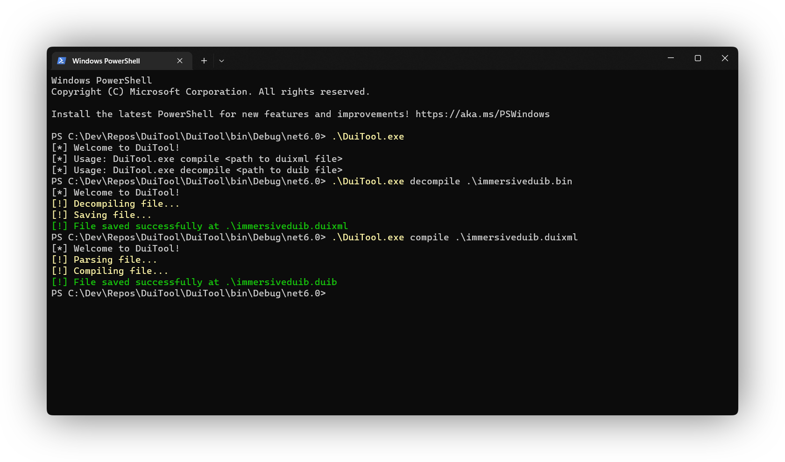

<p align="center">
  
  
  <br><br>
  <b>DuiTool</b><br>
  The ultimate DirectUI tool<br><br>
  <a href="./DuiTool">Source Code</a> | 
  <a href="https://github.com/ahmed605/DuiTool/releases">Downloads</a> | 
  <a href="https://twitter.com/AhmedWalid605">Contact</a>
  <br><br>
  <br><br>
</p>

## Usage

#### Decompiling a DUIB file:
```bash
DuiTool.exe decompile myDuibFile.duib
```

#### Compiling a DuiXml file:
```bash
DuiTool.exe compile myXmlFile.duixml
```

#### Example of input DuiXml file:
```xml
<duixml>
    <richtext contentalign="topleft" content="Hello World!"/>
    <ModernProgressRing background="20575" foreground="20114"/>
    <ModernProgressBar foreground="20114" background="20852"/>
</duixml>
```

## Progress

- [x] DUIB Decompiler
- [x] DUIB Compiler
- [ ] DirectUI Color Helper
- [ ] DuiXml Previewer
- [ ] DuiXml Designer

## Crediting
We kindly ask users of the tool to provide (totally optional) attribution/credit if they utilize any files generated by the tool.

Attribution helps acknowledge the efforts put into creating and maintaining the tool and encourages its continued development.